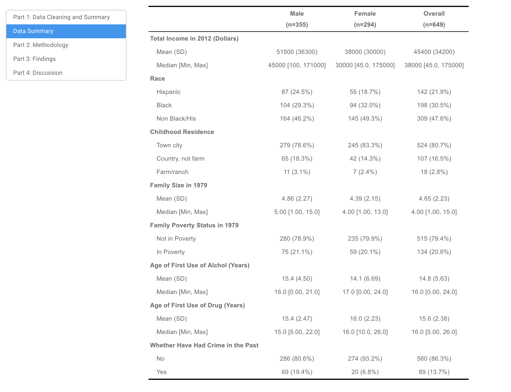
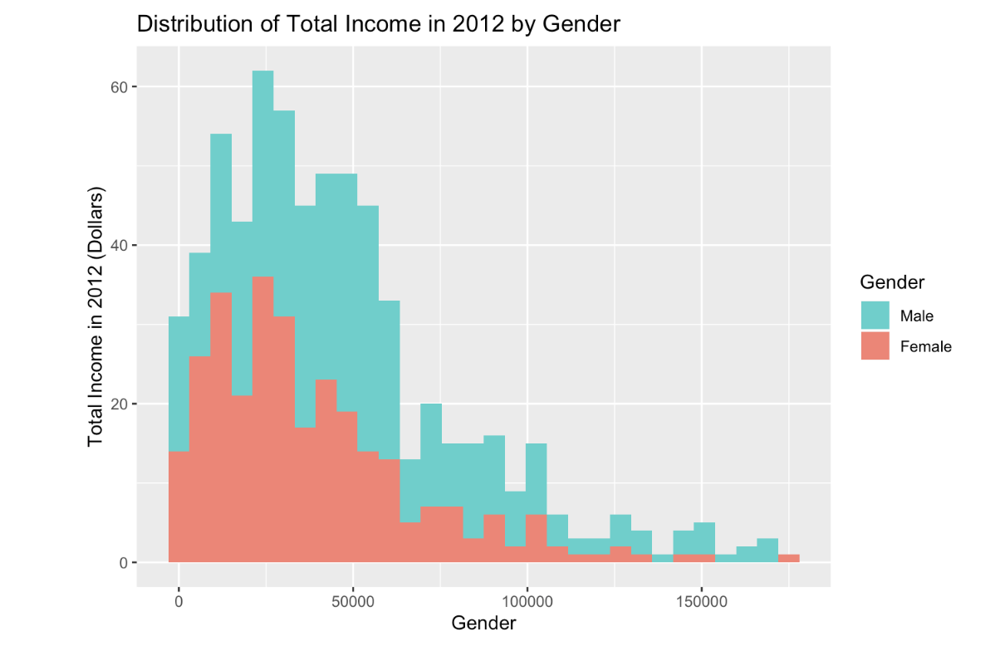
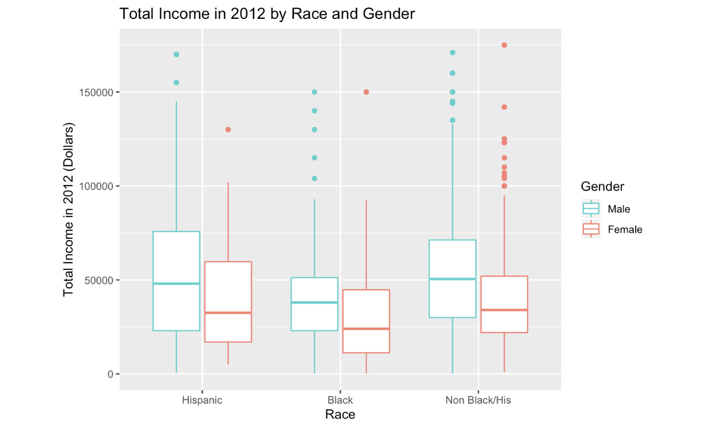
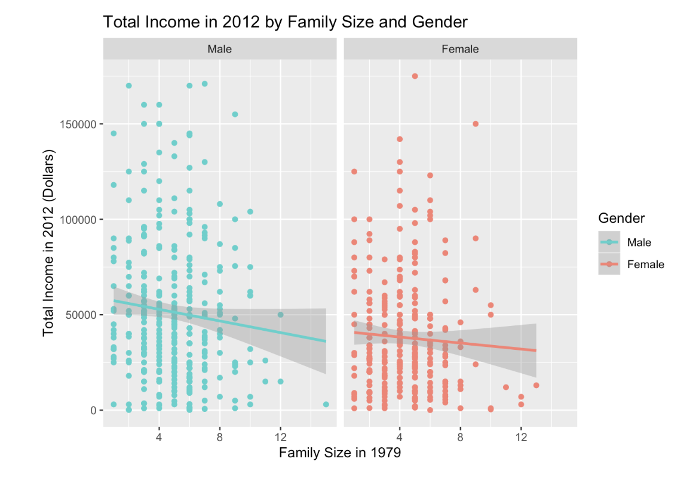
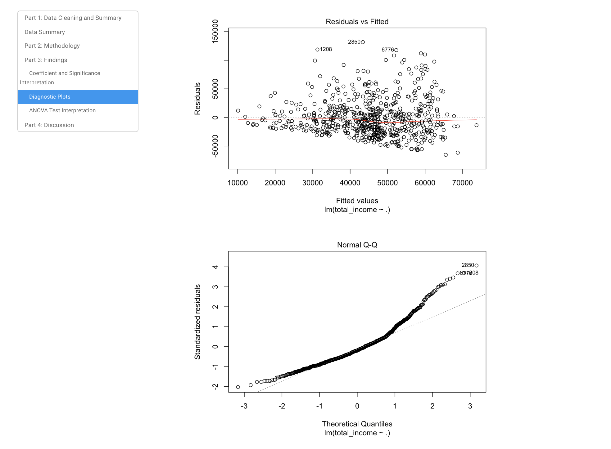

# Analysis Project in R: Gender Gaps In Income
In this analysis project, I used R to address the following problem:

"Is there a significant difference in income between men and women? 
Does the difference vary depending on other factors (e.g., education, marital status, criminal history, drug use, childhood household factors, profession, etc.)?"

Date Source: I pulled together 70 variables from the NLSY79 (National Longitudinal Survey of Youth, 1979 cohort) data set, which contains survey responses on thousands of individuals who have been surveyed every one or two years starting in 1979.

A natural outcome variable for the data is TOTAL INCOME FROM WAGES AND SALARY IN PAST CALENDAR YEAR (TRUNC) (2012 survey question). In my model, I selected 8 out of the 70 variables and explored how they associate with this income variable. I first created a Table 1 to summarize the data: 

I then created a series of charts to explore relationships between variables. Here are a few samples:

I then ran linear regression models and ANOVA tests to investigate how income is associated with gender, as well as other factors such as family poverty status, race and childhood residence. I then used diagnostic plots to examine the validity and accuracy of the linear regression model. Here are 2 of the 4 diagnotic plots: 

Overall, I found that there is a significant difference in income between men and women. The annual income in 2012 for women is significantly lower than that of men. Gender is an important contributor to the variation in annual income. Further, income is also associated with other factors, including race, childhood residnece, family poverty status, and age of first drug use. 

Please see the html file for the complete analysis report.

Please see the Rmd file for all my codes. 
